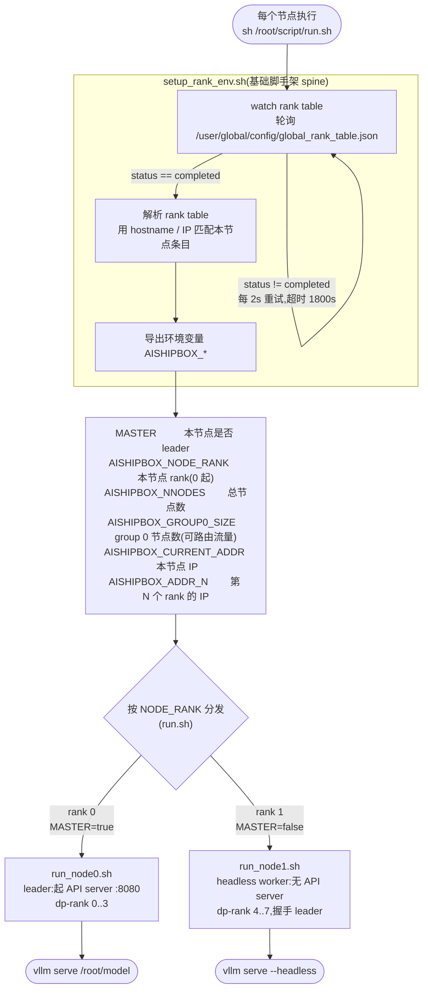

# 教程:在 ModelArts 上做多机多角色部署

**部署第三方开源大模型**已经是越来越常见的落地场景。GLM、DeepSeek 这类参数量巨大的 MoE
模型大多**单机放不下**——要么需要跨节点的张量/数据并行,要么需要 prefill/decode 分离这样的
多角色部署。而这恰恰是工程上最容易出错的环节:同一份脚本要在多台机器上扮演不同角色,节点
地址在运行时才分配,流量路由还有平台层面的约束。

本文讲清楚一件事:**如何结合 ModelArts(MA)的全局 rank table 机制,用一套统一的脚本完成
跨节点、多角色的部署**——从监听 rank table、按角色分发,到推理引擎启动,并能从单机平滑扩展
到 PD 分离的多机集群。

整体流程:每个节点跑同一条 `run.sh`,先**监听 rank table**,解析出**环境变量**,再用环境
变量**比对自己是谁**,最后分发到对应角色脚本。



> 上图以 `2nodes`(双机混合引擎)为例。`1p1d` 只是分发分支变多(prefill / decode / proxy),
> 监听与解析这一段完全一样。

---

## 1. 今天的多机部署流程

先看一下今天用户在平台上做一次多机部署,实际要走的流程。

### 1.1 多机混合部署

1. **配置第一个部署单元**:用主节点脚本启动 vllm 引擎(`--data-parallel-address` 设为本节点 IP);
2. **配置第二个部署单元**:用从节点脚本启动 vllm 引擎(`--data-parallel-address` 设为**主节点
   IP**——而这个 IP 要自己解析 rank table、取出第一个节点的地址才能拿到);
3. 启动部署。

### 1.2 P-D 分离部署

1. **配置第一个部署单元**:执行 P 节点的启动脚本(若一个 P 实例跨多个节点,还要基于 rank table
   取出 P 的首节点 IP 并注入脚本);
2. **配置第二个部署单元**:执行 D 节点的启动脚本;
3. 在第一个部署单元里再起一个 **proxy**,而 proxy 需要列出**所有 P/D 节点的地址**——这些同样
   得靠解析 rank table 拿到。

### 1.3 痛点

两条流程里反复出现同一件事:**地址在运行时才分配,要自己解析 rank table 把它们捞出来再注入
脚本**。再叠加两个工程约束:

- **流量路由约束。** MA 只把服务流量路由到 **group 0** 的节点;headless 节点(不起 API server)
  必须排在 group 0 之外,否则会收到无法处理的请求。
- **多角色脚本易不一致。** prefill / decode 等角色若各写一份脚本,公共部分(网络初始化、rank
  解析)极易彼此漂移、难维护。

于是问题归结为:节点 A 要当 leader 起 API server,节点 B 要当 headless worker 去和 A 握手——
**它们怎么区分自己?又怎么知道彼此的地址?** 答案的源头是 **global rank table**。

---

## 2. rank table 是什么

ModelArts 在集群就绪后,会在每个节点写出一份全局 rank table:

```
/user/global/config/global_rank_table.json
```

它描述了集群里**所有节点**的地址、pod 名、设备编号。真实样例见
[`template/fixtures/global_rank_table-a3-2nodes.json`](../template/fixtures/global_rank_table-a3-2nodes.json),
结构如下(A3 两机、每机 16 卡,节选):

```json
{
    "status": "completed",
    "server_group_list": [
        {
            "group_id": "0",
            "server_list": [
                { "server_ip": "172.16.0.62", "pod_name": "infer-...-role-0-...", "device": [ ... 16 个 ... ] }
            ]
        },
        {
            "group_id": "1",
            "server_list": [
                { "server_ip": "172.16.0.74", "pod_name": "infer-...-role-1-...", "device": [ ... 16 个 ... ] }
            ]
        }
    ]
}
```

几个关键字段:

| 字段 | 含义 | 为什么重要 |
|------|------|-----------|
| `status` | 集群是否就绪 | 必须等到 `"completed"` 才能解析,否则地址不全 |
| `server_group_list` | 节点按 group 分组 | **group 0 = ModelArts 会路由流量的节点** |
| `server_ip` | 节点地址 | 节点据此判断"我是谁",worker 据此找 leader |
| `pod_name` | pod 名 | 备用的身份匹配键 |

**关于 group 的进一步理解:** `server_group_list` 里的每个 group,对应多角色分离部署中的
**一个角色**。`group 0` 是**第一个角色**,可以有 1 个或多个实例(`server_list` 里的条目数);
后续 group 依次是其它角色。

- **推理 1.0** 没有角色概念,因此只有 `group 0`,它的实例个数就等于总实例个数。
- **推理 2.0 / 多角色部署**则会有多个 group,每个 group 一个角色。

这也解释了那条关键约束:**ModelArts 只把服务流量路由到 `group 0`**。所以凡是要对外提供 API
的角色(leader、proxy)必须落在 `group 0`,而 headless worker 这类不起 API server 的节点必须
排在 `group 0` 之外——否则它会收到无法处理的流量。

§1 的流程里,用户「自己解析 rank table 取地址」做的就是把这份 JSON 读出来、按节点序挑出该填
的 IP。下面两个优化,就是把这件事(以及围绕它的公共逻辑)一次性收敛掉。

---

## 3. 优化一:提前解析 rank table,注入标准环境变量

第一个优化很直接:**与其让每个用户脚本反复手搓解析 rank table,不如在统一入口里解析一次,
把结果导出成一组标准环境变量**,后面的脚本直接用变量、再不碰那份 JSON。

这正是 [`setup_rank_env.sh`](../template/setup_rank_env.sh) 干的事——**等** rank table 就绪、
**解析**成环境变量两步:

**① 监听:轮询直到 `status == completed`**(默认超时 1800s,可用 `RANK_TABLE_TIMEOUT` 调):

```sh
while :; do
    status=$(python3 -c "import json; print(json.load(open('$RANK_TABLE')).get('status',''))")
    [ "$status" = "completed" ] && break
    sleep "${RANK_TABLE_INTERVAL:-2}"
done
```

**② 解析:用 `hostname` / `hostname -I` 匹配 rank table 里的条目**,确定本节点的 rank,然后
导出这组变量:

| 变量 | 含义 |
|------|------|
| `AISHIPBOX_NODE_RANK` | 本节点在扁平节点列表里的序号(0 起) |
| `AISHIPBOX_NNODES` | 总节点数 |
| `AISHIPBOX_GROUP0_SIZE` | group 0(可路由流量)的节点数 |
| `AISHIPBOX_CURRENT_ADDR` | 本节点 IP |
| `AISHIPBOX_ADDR_<N>` | 第 N 个 rank 的 IP(worker 据此找 leader / P-D 据此互相寻址) |
| `MASTER` | leader 上为 `true`,其余 `false` |

有了这组变量,用户脚本就**不必再碰 rank table**:从节点的 `--data-parallel-address` 直接填
`$AISHIPBOX_ADDR_0`,proxy 要列的 P/D 地址也都是现成的 `$AISHIPBOX_ADDR_<N>`——§1 里那些
「自己解析、自己注入」的步骤全部消失。

---

## 4. 优化二:统一入口脚手架 + 典型配置

我们做下来发现:从单机到 P-D 分离,**「监听 rank table → 解析 → 按角色分发」这套骨架是完全
一致的**,变的只是最后那段 `vllm serve` 参数。再加上上面那组标准环境变量,就能做到**只下发
一条命令**——不管什么角色、哪个节点,启动命令都是 `bash run.sh`,由脚本内部按 rank 自分角色。

### 4.1 dispatcher:`run.sh` 按 rank 决定角色

统一入口的逻辑三步走:

```sh
here=$(cd "$(dirname "$0")" && pwd)
. "$here/setup_rank_env.sh"        # 1. source 脚手架,等 rank table + 导出 AISHIPBOX_*

# 2. 校验拓扑(节点数 / group 0 大小)
[ "$AISHIPBOX_NNODES" = 2 ] || { echo "期望 2 节点"; exit 1; }
[ "$AISHIPBOX_GROUP0_SIZE" = 1 ] || { echo "group 0 必须只含 leader"; exit 1; }

# 3. 按 rank 分发到对应角色脚本
case "$AISHIPBOX_NODE_RANK" in
    0) exec "$here/run_node0.sh" ;;   # leader,起 API server
    1) exec "$here/run_node1.sh" ;;   # headless worker
esac
```

> 精髓就在这:**同一条 `bash run.sh` 在每台机器上跑,靠 rank 自动分流**。`AISHIPBOX_GROUP0_SIZE`
> 导出的正是 group 0 的实例数,dispatcher 据此校验拓扑,顺带挡住「headless 节点被放进 group 0」
> 这类会导致流量打到不能处理的节点的错误。

### 4.2 角色启动脚本:公共前导 + 各自的 `vllm serve`

每个角色脚本结构相同:**相同的 NIC/socket 前导(脚手架的一部分)+ 各自的 `vllm serve` 参数块**。
前导逐字复制、不要改:

```sh
local_ip="$AISHIPBOX_CURRENT_ADDR"          # 本节点自己的 IP(每个角色都一样)
nic_name=$(ifconfig | awk -v ip="$local_ip" '...')   # 按 local_ip 解析本机网卡名
export HCCL_IF_IP="$local_ip"               # HCCL 绑定到本机 IP
export HCCL_SOCKET_IFNAME="$nic_name"
export GLOO_SOCKET_IFNAME="$nic_name"
export TP_SOCKET_IFNAME="$nic_name"
```

`local_ip` **始终是本节点自己的地址**,用来解析本机网卡、绑定 HCCL/socket——leader 和 worker
完全相同。**真正区分角色的不是 `local_ip`,而是 worker 额外引入的 leader 地址**:headless
worker 单独取 leader 的 IP,传给 `--data-parallel-address` 去握手——而这个 IP 就是优化一里
现成的 `$AISHIPBOX_ADDR_0`,不用再解析 rank table:

```sh
# 仅 headless worker 需要(leader 自己用 local_ip 即可):
leader_ip="$AISHIPBOX_ADDR_0"               # 第 0 个 rank = leader 的地址
...
    --data-parallel-address "$leader_ip" \  # worker 据此找 leader 汇合;leader 这里填 $local_ip
```

leader 自己的引擎参数块(示例):

```sh
exec vllm serve /root/model \
    --port 8080 \
    --data-parallel-size 8 --data-parallel-size-local 4 \
    --data-parallel-address "$local_ip" --data-parallel-rpc-port 12321 \
    --tensor-parallel-size 4 --enable-expert-parallel \
    --quantization ascend \
    --speculative-config '{"num_speculative_tokens": 1, "method": "deepseek_mtp"}' \
    ...
```

### 4.3 两种交付件

落到一线手上,这套优化就是两类东西:

- **一套部署脚手架** —— 统一入口脚本(按 rank 自动分流到对应角色),用户只需填自己模型的
  启动参数,不必从零手写多机编排、网卡绑定、socket 配置这些公共逻辑。
- **典型配置** —— 典型模型 / 平台 / 拓扑的启动脚本集,可直接复用或作为改写基底。

---

## 5. 复杂度递进:同一套骨架,三种 layout

这套模式最有价值的地方:**骨架不变,只是 `run_*.sh` 的数量和角色在变。**

| Layout | 拓扑 | 并行(示例) | 脚本构成 |
|--------|------|------|----------|
| **1node** | 单机 | DP=4×TP=4 | 仅 `run.sh`(无 rank table) |
| **2nodes** | 双机混合引擎 | DP=8×TP=4 | `run.sh` + `run_node{0,1}.sh` |
| **1p1d** | 1P1D 分离 + 外置 DP | P:4/4×4, D:16/1×16 | + `launch_online_dp.py` + `run_dp_template_<role>.sh` + `run_proxy.sh` |

| 文件构成 | 含义 |
|----------|------|
| 仅 `run.sh` | 单机 standalone(无 rank table) |
| `run.sh` + `run_node<N>.sh` | 多机、单一混合引擎(无 P-D 分离) |
| `+ run_<role>_node<N>.sh` + `run_proxy.sh` | P-D 分离(Mooncake KV 传输 + proxy) |
| `+ run_dp_template_<role>.sh` + `launch_online_dp.py` | 分离 + 外置 online DP(每节点 N 个独立 vLLM 实例) |

### 5.1 从 2nodes 到 1p1d:PD 分离 + 外置 online DP

`2nodes` 是一个**混合引擎**:同一批卡既做 prefill 又做 decode。`1p1d` 把两者**拆成独立角色**
——prefill 专注吃 prompt、产出 KV cache,decode 专注消费 KV、出 token,两者各自调优、各自
扩缩容;并且更进一步,**每个 DP rank 都是一个独立的 vllm 进程、各自一个 API server**,再由
proxy 在所有实例间负载均衡。这种"外置 online DP"在隔离性和扩缩容上更灵活。

以本仓库的 `1p1d` 为例,2 个 rank:

```
rank 0 -> prefill: 4 个独立 vllm 实例 (每个 DP=4/TP=4, 4 卡), 端口 7100..7103, kv_producer
rank 1 -> decode : 16 个独立 vllm 实例 (每个 DP=16/TP=1, 1 卡), 端口 7100..7115, kv_consumer
```

相比 `2nodes`,关键变化有三:

**1. 用 `launch_online_dp.py` 批量拉起实例。** 角色脚本不再直接 `vllm serve`,而是调用这个
Python 编排器,由它在本节点 fork 出 N 个实例:

```sh
# run_prefill_node0.sh:
python3 launch_online_dp.py --template run_dp_template_prefill.sh \
    --dp-size 4 --tp-size 4 --dp-size-local 4 --dp-rank-start 0 \
    --dp-address <本机 IP> --dp-rpc-port 12321 --vllm-start-port 7100
```

它的核心循环(简化):为第 `i` 个实例分配**端口 `7100+i`**、**绑定 `i*tp_size .. (i+1)*tp_size-1`
这几张卡**,再用 `--data-parallel-rank i` 把它加入同一个 DP 组:

```python
for i in range(dp_size_local):
    vllm_engine_port = vllm_start_port + i
    visible_devices  = range(i*tp_size, (i+1)*tp_size)   # 该实例独占的卡
    # bash run_dp_template_*.sh <visible_devices> <dp_rank=i> <port> ...
```

**2. 每实例一份模板(`run_dp_template_<role>.sh`)+ KV 传输面。** 模板就是单个实例的
`vllm serve`。`2nodes` 是混合引擎、不需要传 KV;PD 分离后,prefill 是生产者、decode 是消费者,
中间用 `MooncakeHybridConnector` 传 KV cache:prefill 填 `kv_role=kv_producer`(`kv_port=36000`、
`engine_id=0`),decode 填 `kv_role=kv_consumer`(`kv_port=36100`、`engine_id=1`)。两边的
`dp_size`/`tp_size` 要在 `kv_connector_extra_config` 里写明、对齐。

**3. proxy 要连所有实例端点。** `2nodes` 客户端直接请求 leader 的 `:8080`;PD 分离后一个请求
要先经 prefill 产 KV、再交给 decode 出 token,必须有 proxy 编排。这里 proxy 把 prefill 的
4 个(`AISHIPBOX_ADDR_0:7100..7103`)和 decode 的 16 个(`AISHIPBOX_ADDR_1:7100..7115`)
**全部**列进去——再次用到优化一的现成地址——对外暴露 `:8080`:

```sh
N_PREFILL=4; N_DECODE=16
# --prefiller-hosts ADDR_0×4 --prefiller-ports 7100..7103
# --decoder-hosts  ADDR_1×16 --decoder-ports 7100..7115  --port 8080
```

> 还有一个分发上的小差异:`1p1d` 的 `run.sh` 允许 `GROUP0_SIZE` 为 1 或 2,并且**凡是 group 0
> 的节点都会顺带在后台拉起 proxy**(`sh run_proxy.sh &`)——proxy 不再占一个独立 rank,而是和
> 引擎同节点共存。

---

## 6. 参考实现:`template/` 是 source of truth

本仓库就是上面这套优化的一份可直接复用的参考实现,在不同模型 / 平台 / 拓扑的部署上复用同一套
骨架,验证了它的通用性:

- [`setup_rank_env.sh`](../template/setup_rank_env.sh) —— rank table 监听 + 解析 + 注入标准
  环境变量(优化一的实现);
- `run.sh`(模板见 [`template/run.sh.tmpl`](../template/run.sh.tmpl))—— 统一入口,source
  上面的脚本后按 rank `exec` 到对应角色的启动脚本(优化二的骨架)。

与模型无关的构建块以 [`template/`](../template/) 为**源**。每个 layout 都携带一份**逐字节
相同的真实副本**(symlink 撑不过 ModelArts 的平铺复制)。脚手架契约见
[`template/README.md`](../template/README.md)。

检查脚手架是否与 `template/` 漂移(drift):

```bash
md5 template/setup_rank_env.sh models/*/*/setup_rank_env.sh   # 必须全部一致
```

---

## 7. FAQ

### 1. 这套方案推理 1.0 和 2.0 都支持吗?

**都支持。** 这套模式只依赖 ModelArts 的全局 rank table(`/user/global/config/global_rank_table.json`),而 1.0、2.0 都会生成它,所以两边通用。

- 在 **1.0** 上:平台只能下发同一条命令,本方案正好用 `run.sh` 按 rank 自动分流,补上了"分角色"的能力。
- 在 **2.0** 上:即使用平台的多角色配置,worker 仍要在运行时发现 leader 地址——本方案的 `setup_rank_env.sh` 照样解决这个问题,而且公共逻辑只写一份,比逐角色配命令更省事。

换句话说:**它不是替代平台能力,而是把"运行时发现 + 分角色启动"这件平台不替你做的事收敛到一处。**

> **1.0 有一点要特别注意:1.0 只有 `group 0`,所有节点都在 group 0 内,因此平台要求每个节点都对外启动服务(健康检查针对全部节点)。** 也就是说,在 1.0 上不能让某个节点"只当 headless worker 而不起 API server"——否则该节点健康检查不过、部署会被判失败。需要 headless 节点的形态(如本文 `2nodes` 的 rank 1),只能在 **2.0 多 group** 下把它放到 group 0 之外。规划拓扑时先确认你用的是哪个版本。

### 2. 这些部署脚本可以分享吗?

我们会**逐步把验证过的场景开放出来**,也**欢迎大家贡献**:把你在新模型 / 新平台 / 新拓扑上跑通的 layout 提过来,标注好验证状态,让这套模式覆盖更多场景、少踩重复的坑。

### 3. 部署时最需要注意什么?

容易踩的坑:

- **有且仅有 group 0 对外提供服务。** ModelArts 只把流量路由到 `group 0`。所以**凡是要对外的角色(leader、proxy)必须落在 group 0,headless worker 等不起 API server 的节点必须排在 group 0 之外**;否则要么流量打到不能处理的节点,要么能服务的节点收不到流量(见 §2)。

### 4. 模型路径、端口这些是固定的吗?

约定俗成、建议固定,但可改:

- **模型路径恒为 `/root/model`**(serve 路径 + chat-template 路径都用它),不要用 modelscope 缓存路径。**但推理 1.0 的容器以 `ma-user`(非 root)运行,访问不了 `/root`**,这种情况把模型路径改成 `/home/ma-user/model`(ma-user 的家目录,有写权限)即可——注意**所有引用处都要一起改**(`vllm serve <模型路径>`、`--chat-template`、模型挂载/下载脚本等),漏改一处就会加载失败。同理脚本目录在 1.0 下是 `/home/ma-user/script`(2.0 为 `/root/script`),启动命令相应改为 `sh /home/ma-user/script/run.sh`(脚本内容无需改,`run.sh` 用 `$here` 运行时定位自身)。
- **API / proxy 端口**按各 layout 约定(混合引擎 leader 用 `:8080`,PD 分离各引擎用 `:7100+i`、proxy 对外 `:8080`),改的话要前后一致、并和 proxy 配置对齐。

---

## 8. 加一个新部署

从官方 vLLM-Ascend 教程提取参考配置、适配本仓库 spine 与约定的完整流程,见
**`new-deployment` skill** 与 [`CLAUDE.md`](../CLAUDE.md)。要点:

1. 选最接近的已验证 layout 作基底,整目录复制。
2. 从 `template/` **逐字复制** spine:`cp template/setup_rank_env.sh template/check_hccn.sh <新 layout>/`。
3. 写 `meta.yaml` 记录来源 URL、`derived` 日期、`vllm` / `vllm_ascend` 版本、`verified: false`。
4. 按平台 NPU 数(A2=8、A3=16)调 `--data-parallel-size-local` × `--tensor-parallel-size`
   == 单节点 NPU 数;改 `--served-model-name` / parser / `--max-model-len` 等模型相关项;
   PD 还要对齐 kv_port / engine_id / `kv_connector_extra_config` 与 proxy 端点。
5. **真机验证后**才把 `meta.yaml` 的 `verified` 与 [README](../README.md) 的状态表改为已验证。

检查 spine 是否与 `template/` 漂移:

```bash
md5 template/setup_rank_env.sh models/*/*/setup_rank_env.sh   # 必须全部一致
```
