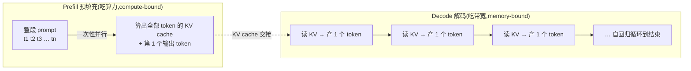
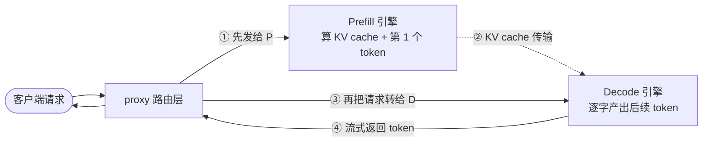
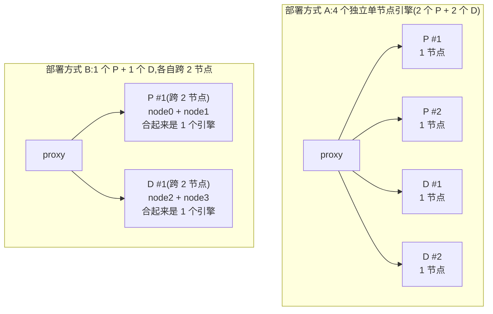
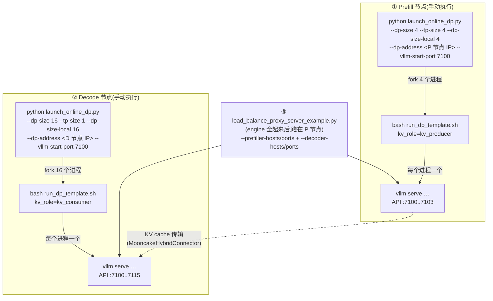
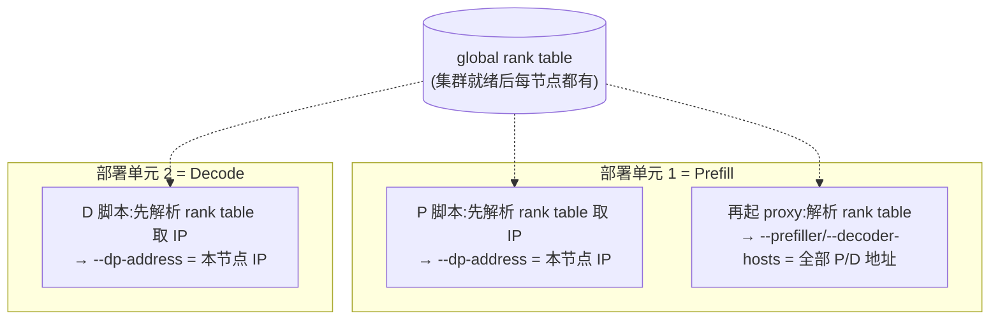
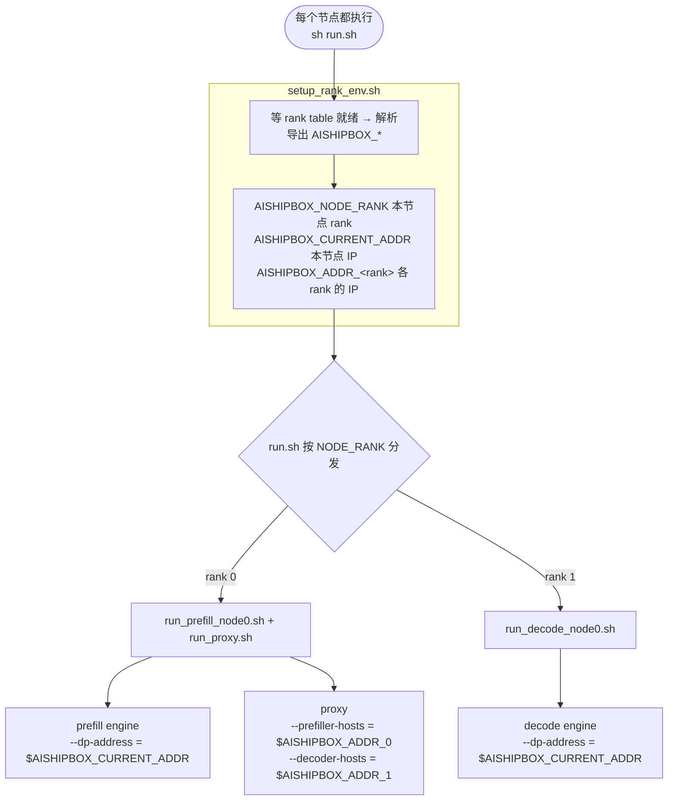

# PD 分离部署教程


## 第 1 章:什么是 PD 分离部署

**一句话:PD 分离就是把 LLM 推理的两个阶段——prefill 和 decode——拆到两组独立的
引擎(通常是两组机器)上分别跑,而不是挤在同一批卡上。**

要理解为什么这么拆,先看这两个阶段本质上有多不一样。

### 推理的两个阶段

一次请求的生成,天然分成前后两段:

- **Prefill(预填充)**:把整个 prompt 一次性喂进模型,**并行**算出所有输入 token 的
  KV cache,并吐出第一个输出 token。prompt 越长,这一步的矩阵乘越大——它**吃算力**
  (compute-bound),batch 稍微一大就能把 NPU 算力打满。

- **Decode(解码)**:基于已经算好的 KV cache,**一次只产 1 个 token**,然后把它接回
  输入再产下一个,自回归地循环到结束。每一步的计算量都很小,真正的瓶颈是反复读取
  KV cache 和权重——它**吃访存/显存带宽**(memory-bound),算力大量闲置。

换句话说,两个阶段的资源画像几乎是**相反**的:一个缺算力,一个缺带宽。



> 左边一个大箭头**一次性并行**吃完整段 prompt(算力密集),右边一串小步骤**逐字循环**、
> 反复读 KV(访存密集)——这就是两个阶段最本质的差别。中间的虚线“KV cache 交接”,
> 正是后面 PD 分离要跨引擎传输的那份数据。

### 为什么合并部署会互相拖累

如果同一批卡既做 prefill 又做 decode(混合引擎),问题就来了:

- **互相抢、互相堵**:一个长 prompt 的 prefill 占满算力时,正在逐字生成的 decode 请求
  会被卡住——已经在跟你对话的用户突然感觉“吐字卡顿”。反过来,decode 占着卡也会拖慢
  新请求的首字响应。两个关键延迟指标(TTFT 首字延迟、TPOT 每字延迟)互相干扰。

- **配比必然浪费**:两阶段需求相反,放一起就只能折中一套并行/批处理配置,结果是
  prefill 嫌带宽不够、decode 嫌算力用不上,哪一方都没调到最优。

### PD 分离怎么解决

把两段拆开,各管各的:

- **Prefill 引擎**专注处理 prompt、产出 KV cache,按“算力密集”去调优和扩容；
- **Decode 引擎**专注消费 KV、逐字出 token,按“访存密集”去调优和扩容；
- 一个请求先在 prefill 引擎算完 KV,再把 KV **传输**给 decode 引擎继续生成。

这样两边互不抢占、各自按自己的瓶颈独立扩缩容,延迟和吞吐都更可控。

### proxy(请求路由)

有了 P 和 D,还缺一个把它们**串起来**的角色——**proxy(路由层)**。因为 prefill 和
decode 是两组独立引擎、各有各的地址,客户端不可能自己先调一个再调另一个。proxy 就站在
最前面,把“先 P 后 D”这条链路对客户端隐藏成**一次普通请求**:



1. 客户端把请求发给 proxy;
2. proxy 先转给某个 **prefill 引擎**,算出 KV cache 和第一个 token;
3. proxy 再把请求转给某个 **decode 引擎**,decode 拿到 prefill 传来的 KV,接着产出后续 token;
4. 生成的 token 经 proxy 流式返回客户端。

注意区分两条线:**请求**走 proxy 转发(实线),而 **KV cache** 是在 prefill 和 decode
引擎之间直接传输(虚线 ②),不经过 proxy。

所以一套最小的 PD 分离,部署上其实是**三种角色**:prefill 引擎、decode 引擎、proxy。
proxy 还顺带做一件事——在多个 P / 多个 D 之间做负载均衡(下一章讲拓扑时会展开)。

---

## 第 2 章:为什么需要多种拓扑

第 1 章我们得到了三种角色:P、D、proxy。最朴素的部署方式就是“一个 P + 一个 D”。但真实
负载一压上来,这个固定组合很快就不够用——于是有了各种**拓扑(layout)**。逼出不同拓扑的,
主要是三个压力。

### 压力一:P 和 D 的“量”往往不匹配

prefill 和 decode 的吞吐本就不一样,实际流量里两者的压力很少正好 1:1:

- prompt 长、并发高时,**P 先成为瓶颈**——要多加几个 P;
- 反过来,生成很长、decode 跟不上时,**D 成为瓶颈**——要多加几个 D。

所以拓扑必须支持**不对等配比**(比如 2 个 P + 1 个 D、或 1 个 P + 3 个 D),而不是锁死 1:1。
P 和 D 各要几个,是第一个会变的维度。

### 压力二:单个引擎一台机器放不下

大 MoE 模型(权重 + KV cache)常常**单台机器装不下**。这时一个引擎本身就要横跨多台机器,
用张量并行 / 专家并行(TP/EP)把它切到几个节点上一起算。

于是“一个 P”可能其实是“一个 P 占 2 个节点”:

- **有几个 P / 几个 D**(独立实例的个数);
- **每个实例占几个节点**(单台放不下时才会 > 1)。

拓扑要能同时表达这两件事。

### 压力三:角色一多,proxy 要连的 API endpoint 就变了

proxy 得把**所有** P 和 D 的 API endpoint 都列进去,才能在它们之间做负载均衡。P/D 的数量一变、
每个实例占几节点一变,proxy 的配置就完全不同——这也是为什么拓扑必须被**精确描述**出来,
否则 proxy 根本不知道该连谁。

### 同样 4 台机器,拓扑可以完全不同

下面两种部署方式**节点数相同(都用 4 台机器)**,但拓扑、独立引擎数都不一样:



- **部署方式 A**:**4 个独立引擎**(2P+2D),每个引擎单独占 1 台机器；适合“单台放得下、想多堆几个实例提吞吐”。
- **部署方式 B**:只有 **2 个引擎**(1P+1D),但每个横跨 2 台机器(单台放不下)；适合“单个引擎太大、必须跨节点”。

两者机器数一样,部署方式却天差地别——所以光说“几台机器”远远不够,得能把“几个 P、几个 D、
每个占几节点”说清楚。为此我们约定了一套 layout 命名法,见文末 FAQ。

---

## 第 3 章:官方 DeepSeek-V4-Flash 1P1D 方案

前两章都是概念。这一章把它落到官方的真实脚本上,看一套 1P1D 到底由哪些脚本组成、
按什么顺序执行。以 DeepSeek-V4-Flash 的官方 1P1D 为例:1 个单节点 prefill(DP=4、TP=4)
+ 1 个单节点 decode(DP=16、TP=1)。

参考:
[DeepSeek-V4-Flash 模型页](https://docs.vllm.ai/projects/ascend/en/latest/tutorials/models/DeepSeek-V4-Flash.html)
(engine 启动)和
[Mooncake 多节点 PD 页](https://docs.vllm.ai/projects/ascend/en/latest/tutorials/features/pd_disaggregation_mooncake_multi_node.html)
(proxy)。

### 脚本关系与执行顺序



### 三步执行,两类脚本

整套 1P1D 其实只有两类 engine 脚本 + 一个 proxy 脚本,按 **prefill → decode → proxy** 的顺序起:

1. **在 prefill 节点**跑 `launch_online_dp.py`(`--dp-address` 填本节点 IP)。它按
   `--dp-size-local` **fork 出 4 个进程**,每个进程 `bash run_dp_template.sh …` 起一个
   `vllm serve`(`kv_role=kv_producer`,API endpoint :7100..7103)。
2. **在 decode 节点**同样跑一遍(`--dp-address` 填 decode 节点 IP),fork 出 16 个
   `vllm serve`(`kv_role=kv_consumer`,API endpoint :7100..7115)。
3. **两侧 engine 全部起来后**,在 prefill 节点起 `load_balance_proxy_server_example.py`,
   把全部 P/D 的 API endpoint(4 个 prefill + 16 个 decode)用
   `--prefiller-hosts/--prefiller-ports`、`--decoder-hosts/--decoder-ports` 列进去。

| 脚本 | 在哪跑 | 干什么 |
|------|--------|--------|
| `launch_online_dp.py` | prefill 节点、decode 节点各跑一次 | 编排器:按 `dp-size-local` fork N 个进程,各自分配 NPU / API endpoint / dp-rank |
| `run_dp_template.sh` | 被 `launch_online_dp.py` fork 调用 | 单实例模板:设环境变量 + `vllm serve`；靠 `kv_role` / `kv_port` / `engine_id` 区分 P/D |
| `load_balance_proxy_server_example.py` | engine 起来后,跑在 prefill 节点 | 把请求先发 P 再发 D,在所有 P/D 的 API endpoint 间负载均衡 |

> 两点呼应前两章:① prefill 和 decode 用的是**同一个 `run_dp_template.sh`**,只改 `kv_role` /
> `kv_port` / `engine_id` 区分生产者/消费者；② **KV cache 在 P/D 引擎间直接传输(走
> MooncakeHybridConnector),不过 proxy**——proxy 只转发 HTTP 请求。这正是第 1 章那张图里
> “请求走 proxy、KV 走引擎间直连”的真实落地。

---

## 第 4 章:怎么在 ModelArts 上跑

把第 3 章那套官方脚本搬到 ModelArts(MA)上,有基础和优化两种做法。

### 4.1 基础方案:MA 多角色部署,各角色一份脚本

MA 提供**多角色部署**:你按角色逐个加“部署单元”,每个单元执行一个脚本。1P1D 就是:



1. **第一个部署单元指定为 P**,执行 prefill 脚本(`--dp-address` 填本节点 IP);
2. **第二个部署单元指定为 D**,执行 decode 脚本；
3. 在第一个部署单元里**再起 proxy**,它要列出**所有 P/D 节点的地址**。

这些 IP(本节点的、所有 P/D 的)MA 都是**运行时才分配**的,所以脚本不能写死。需要在真正的启动命令之前,先加一段脚本去 **global rank table** 里解析出 IP 再注入。

### 4.2 优化方案: 提供一个适配骨架，把官方脚本包裹一下

我们可以将解析逻辑**收敛到一处**、角色**按 rank 自动分发**——**所有节点下发同一条 `sh run.sh`** 即可。



对应 4.1 的两点:

- **解析逻辑收敛到一处。** 不再每份脚本各写一遍——`setup_rank_env.sh` 统一解析 rank table,
  导出 `AISHIPBOX_CURRENT_ADDR`(本节点 IP)和 `AISHIPBOX_ADDR_<rank>`(各 rank 的 IP)。
  各角色脚本直接用变量:本节点 `--dp-address` 填 `$AISHIPBOX_CURRENT_ADDR`,proxy 的
  `--prefiller-hosts` / `--decoder-hosts` 从 `$AISHIPBOX_ADDR_0` / `$AISHIPBOX_ADDR_1` 拼出来。
- **角色不用逐单元指定。** `run.sh` 按 `AISHIPBOX_NODE_RANK` 做 `case` 分发:rank 0 → prefill
  (并在后台起 proxy),rank 1 → decode。同一条命令,落在哪个 rank 就自动当哪个角色。

> 一条约束:proxy 必须落在能收外部流量的节点。MA 只把服务流量路由到 **group 0**,本仓库
> 约定 group 0 只含 rank 0 这一个节点,所以 proxy 跟 prefill 一起跑在 rank 0 上。(细节见
> [`design.md`](design.md)。)

一句话:**官方脚本本身不动,spine 只是把“解析 rank table”收敛进 `setup_rank_env.sh`、再用
`run.sh` 按 rank 自动分发**——基础方案里那份重复的解析逻辑和逐单元分角色,就都省掉了。

### 4.3 动手:搭一个最小骨架,再装进官方脚本

下面把 4.2 的 spine 亲手搭一遍。骨架只有两个我们自己写的文件,其余直接复用第 3 章的官方脚本。

> 这里是**教学精简版**,只为讲透核心逻辑；本仓库 `template/` 里是完整版(带超时、日志、
> 更多变量)。

**第 1 步:`setup_rank_env.sh`——等 rank table 就绪,只导出本次要用的变量。**

```sh
#!/bin/sh
# source 我(别用 && 链,导出的变量会随子 shell 消失)
RANK_TABLE=/user/global/config/global_rank_table.json

# 1. 等 ModelArts 写好 rank table(status=completed)
while [ "$(python3 -c "import json;print(json.load(open('$RANK_TABLE')).get('status',''))" 2>/dev/null)" != "completed" ]; do
    echo "[rank-env] 等待 rank table..."; sleep 2
done

# 2. 用本机 IP 在扁平节点列表里定位自己的 rank,导出本次要用的几个变量
eval "$(python3 - <<'PY'
import json, subprocess
servers = [s for g in json.load(open("/user/global/config/global_rank_table.json"))["server_group_list"]
             for s in g["server_list"]]
my_ip = subprocess.check_output(["hostname", "-I"]).split()[0].decode()
rank  = next(i for i, s in enumerate(servers) if s["server_ip"] == my_ip)
print(f"export AISHIPBOX_NODE_RANK={rank}")
print(f"export AISHIPBOX_CURRENT_ADDR={servers[rank]['server_ip']!r}")
for i, s in enumerate(servers):
    print(f"export AISHIPBOX_ADDR_{i}={s['server_ip']!r}")
PY
)"
```

**第 2 步:`run.sh`——按 rank 分角色,直接调 `launch_online_dp.py`。**

```sh
#!/bin/sh
here=$(cd "$(dirname "$0")" && pwd)
. "$here/setup_rank_env.sh"          # source,导出 AISHIPBOX_*

case "$AISHIPBOX_NODE_RANK" in
  0)   # prefill,并在后台拉起 proxy
    sh "$here/run_proxy.sh" &
    exec python3 "$here/launch_online_dp.py" \
        --template "$here/run_dp_template_prefill.sh" \
        --dp-size 4 --tp-size 4 --dp-size-local 4 \
        --dp-address "$AISHIPBOX_CURRENT_ADDR" --vllm-start-port 7100 ;;
  1)   # decode
    exec python3 "$here/launch_online_dp.py" \
        --template "$here/run_dp_template_decode.sh" \
        --dp-size 16 --tp-size 1 --dp-size-local 16 \
        --dp-address "$AISHIPBOX_CURRENT_ADDR" --vllm-start-port 7100 ;;
esac
```

**第 3 步:把官方脚本复制进来。** 骨架就上面两个文件,剩下的直接用第 3 章那套官方脚本,
逻辑不用改:

- `launch_online_dp.py`、`run_dp_template.sh`(复制成 `run_dp_template_prefill.sh` /
  `run_dp_template_decode.sh`,各自填好 `kv_role` / `kv_port` / `engine_id`);
- `load_balance_proxy_server_example.py`(proxy 本体),再写一个一行的 `run_proxy.sh`,
  用 `$AISHIPBOX_ADDR_0`(P)、`$AISHIPBOX_ADDR_1`(D)拼出 `--prefiller-hosts` /
  `--decoder-hosts`。

装好后一个 layout 目录长这样,所有节点下发同一条 `sh run.sh` 即可:

```
run.sh                                 # 骨架:按 rank 分角色(自己写)
setup_rank_env.sh                      # 骨架:解析 rank table(自己写)
run_proxy.sh                           # 骨架:拼 P/D 地址起 proxy(自己写)
launch_online_dp.py                    # 官方:fork 多实例
run_dp_template_prefill.sh             # 官方模板:kv_producer
run_dp_template_decode.sh              # 官方模板:kv_consumer
load_balance_proxy_server_example.py   # 官方:proxy
```

骨架(自己写的 3 个)负责“解析 + 分角色 + 拼地址”,引擎和 proxy 的实际逻辑全是官方脚本——
换个模型 / 拓扑,通常只动骨架里的 `case` 和 `launch_online_dp.py` 参数。

---

## FAQ

### 我们怎么给一个 layout 命名？

> 这不是官方标准,而是**本仓库为了把拓扑写清楚而约定的命名法**。

我们用 **`<A>x<B>p<C>x<D>d`** 来命名一个 PD 拓扑:

- **A / C** = prefill / decode 的**实例数**(几个独立引擎,各自一个 KV endpoint);
- **B / D** = 每个实例**跨几个节点**(单台放得下就是 1,放不下才 > 1);
- 节点数为 1 时省略 `x1`。所以 `1x2p` 读作“1 个跨 2 节点的 P”,`2p` 读作“2 个单节点的 P”。

拿第 2 章那两种部署方式和最基础的 1P1D 对号入座(KV endpoint 数 = 独立引擎数):

| layout | 含义 | P 实例×节点 | D 实例×节点 | 总节点 | 独立引擎数(KV endpoint) |
|--------|------|:-----------:|:-----------:|:------:|:-----------------------:|
| `1p1d` | 最基础:1 个单节点 P + 1 个单节点 D | 1 × 1 | 1 × 1 | 2 | 1P + 1D = **2** |
| `2p2d`(第 2 章部署方式 A) | 2 个单节点 P + 2 个单节点 D | 2 × 1 | 2 × 1 | 4 | 2P + 2D = **4** |
| `1x2p1x2d`(第 2 章部署方式 B) | 1 个跨 2 节点 P + 1 个跨 2 节点 D | 1 × 2 | 1 × 2 | 4 | 1P + 1D = **2** |

`2p2d` 和 `1x2p1x2d` 总节点数都是 4,独立引擎却是 4 vs 2——命名法的作用就是把这种差别一眼写明白。
